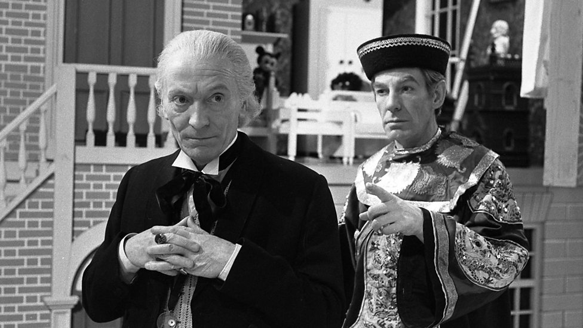
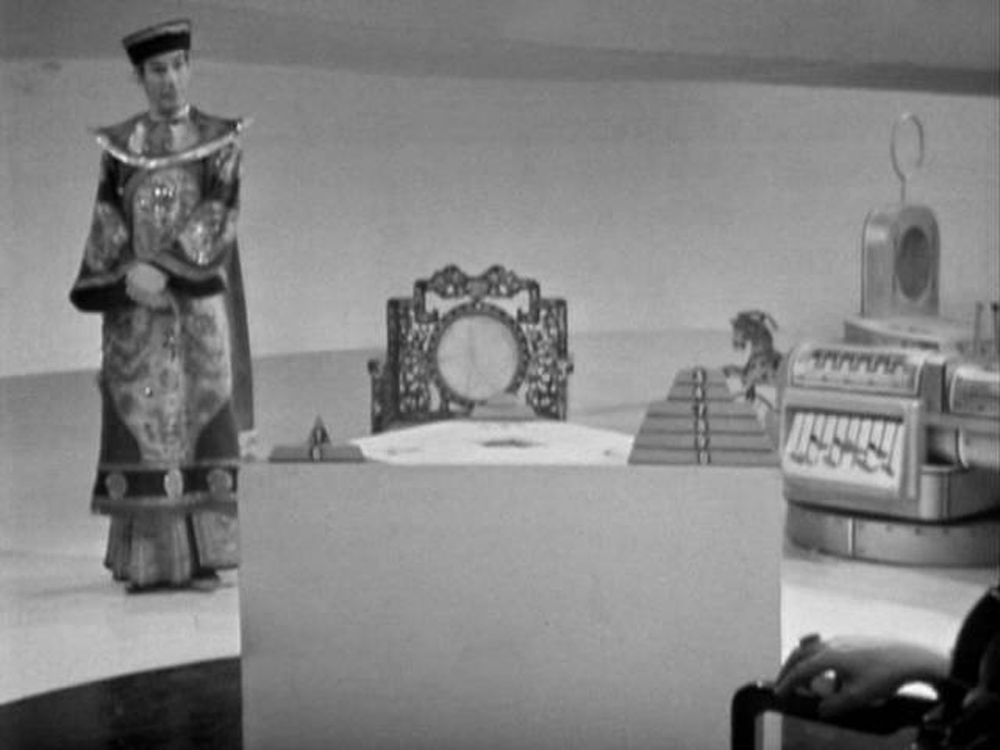
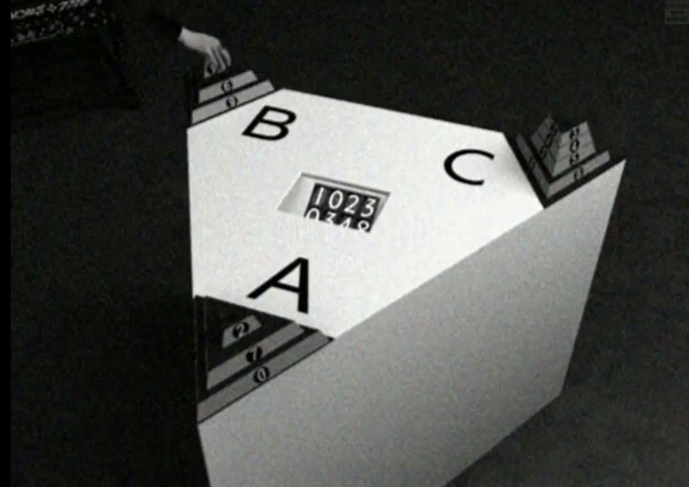

The Trilogic Game
=================

Later I came to know it as the Towers of Hanoi problem, but I first encountered it in 196x in as a challenge to Doctor Who set by the Celestial Toymaker. For his amusement, the Toymaker (played by a very menacing Michael Gough) had captured the Doctor and his companions, snatching the Tardis out of time and space, to be released only if they won the games and solved the puzzles he set them.



The Doctor’s challenge was ‘The Trilogic Game’. A triangular board had at one corner ten triangles of different sizes, stacked from largest to smallest. Moving only one triangle at a time, the Doctor was to shift the entire stack from one corner of the board to another, never placing a larger triangle on a smaller. 



And he had to do it in no more than 1,023 moves. 



I was horrified and fascinated. I struggled to solve mate-in-3 chess problems. How could even the Doctor envisage a thousand-move solution? Unless… was there a system that would save him and his companions?

And there it came to me. If there were a solution for nine triangles, he could move the top nine from A to C, the bottom triangle from A to B, then the top nine from C to B. And if you could do that for ten, you could do the same for nine, and eight, and … I just needed a solution for two triangles. I had stumbled upon induction – or in coding, recursion.

First Python solution
---------------------

Asked for code for the Towers of Hanoi, ChatGPT immediately produced a recursive solution. 
The recursive core of it is in `move()`.

```python
def move(n, source, target, auxiliary, towers):
    if n == 1:
        disk = towers[source].pop()
        towers[target].append(disk)
        print(f"Move disk {disk} from {source} to {target}")
        print_towers(towers)
    else:
        move(n - 1, source, auxiliary, target, towers)
        move(1, source, target, auxiliary, towers)
        move(n - 1, auxiliary, target, source, towers)
```

Disks, not triangles, in the Tower of Hanoi. Here we see my childhood logic: if moving one disk, just move it to the target. Otherwise move _n-1_ to the auxiliary, move 1 to the target, then _n-1_  from auxiliary to target.

The rest of the code just sets up the board (`tower_of_hanoi()`), displays the board state (`print_towers()`) and (`main`) asks how high a tower you want. 

APL from Python
---------------

Setting aside slight differences in syntax, the APL `move` requires only two modifications.

```apl
 move(n source target auxiliary towers)
 :If n=1
     disk←(⊣⊃⍨≢)towers⍎source
     ⍎f'towers.{source}←¯1↓towers.{source}'
     ⍎f'towers.{target},←{disk}'
     f'Move disk {disk} from {source} to {target}'
 :Else
     print_towers towers
     move(n-1)source auxiliary target towers
     move 1 source target auxiliary towers
     move(n-1)auxiliary target source towers
 :EndIf
```

The `pop` method on a Python list returns its last item and, as a side effect, removes it from the list. APL takes a more functional approach and avoids side effects, so one expression picks the top disk, another shortens the tower.

The towers are represented as variables `towers.A`, `towers.B` and `towers.C` so redefining them entails constructing a string `⍎f'towers.{source}←¯1↓towers.{source}'` and evaluating it. 
If instead `source`, `target` and `auxiliary` were numbers then the `pop` and `append` could be written as

```apl
(target⊃towers),←(≢⊃⊢)source⊃towers
(source⊃towers)↓⍨←¯1
```

Above, the composition `(≢⊃⊢)` picks the last item from a list and assigning through Catenate `,` appends it.
Assigning `¯1` through Drop By `↓⍨` removes the last item. 

APL from scratch
----------------

Where the Python solution loops through moves, adjusting the board state along the way, our APL solution will take a more functional approach, generating data structures we can experiment with to explore the problem space.

To start with, we don’t actually _need_ the towers to generate the moves. We can just generate the list of moves needed to shift $N$ disks from one tower to another.

```apl
 shift←{
    ⍝ moves to shift ⍵ disks from tower ⍺[1] to ⍺[2]
     (s t)←⍺                         ⍝ source, target
     ⍵=1:,⊂s t                       ⍝ shift 1 ring
     o←⊃s t~⍨⍳3                      ⍝ other
    ⍝ shift n-1; shift 1; shift n-1
     (s o ∇ ⍵-1),(⊂s t),o t ∇ ⍵-1
 }
```

The left argument is the source and target towers, renamed respectively to `s` and `t`. 
The function returns a list of moves, each move a pair of tower numbers. 
If the right argument – the number of disks to shift – is 1, then the result is `,⊂s t`. 
Otherwise the same resukt gets sandwiched between two calls to `shift ⍵-1`.

Here are the moves to shift 3 disks from 1 to 2. 

```apl
      1 2 shift 3
┌───┬───┬───┬───┬───┬───┬───┐
│1 2│1 3│2 3│1 2│3 1│3 2│1 2│
└───┴───┴───┴───┴───┴───┴───┘
```

The 1-disk shift `1 2` can be seen between the two 2-disk shifts. 

```apl
      (1 3 shift 2)(1 2 shift 1)(3 2 shift 2)
┌─────────────┬─────┬─────────────┐
│┌───┬───┬───┐│┌───┐│┌───┬───┬───┐│
││1 2│1 3│2 3│││1 2│││3 1│3 2│1 2││
│└───┴───┴───┘│└───┘│└───┴───┴───┘│
└─────────────┴─────┴─────────────┘
```

Now we have a simple expression to explore the relationship between $N$ and the number of moves.

```apl
      ≢¨1 2∘shift¨⍳10
1 3 7 15 31 63 127 255 511 1023
```

### A mathematical sidebar

Clearly, if $H(x)$ is the number of moves required to shift $x$ disks, then $H$ is $2^x-1$, or `{(2*⍵)-1}`.

We can prove this inductively. (Thank you, Doctor.) 
From the algorithm:

$$H(x) ≡ 1+2.H(x-1)$$

so if

$$H(x-1) ≡ 2^{x-1}-1$$

then

$$1+2.H(x-1) ≡ 1+2^x-2$$
$$≡2^x-1$$

We see that if $H(x-1)$ is $2^{x-1}-1$ then $H(x)$ is $2^x-1$. 
As $H(1)$ is $2^1-1$, then the relationship holds for all values of $x$.


### Back to the board

We have generated all the moves required for a shift, but have yet to apply them to the towers.

Represent the towers as three int vectors:

```apl
      ⊢board←⍳¨5 0 0
┌─────────┬┬┐
│1 2 3 4 5│││
└─────────┴┴┘
```

Function `move` applies move `⍵` to board `⍺` and returns the revised board.

```apl
 move←{
    ⍝ in ⍺ move top disk from ⍵[1] to ⍵[2]
     (s t)←⍵              ⍝ source, target
     td←⊃s⊃⍺              ⍝ top disk
     (fe te)←↓(s t)∘.=⍳3  ⍝ from each, to each
     (te⍴¨⊂td),¨fe↓¨⍺
 }
 ```

Note above the expression `(fe te)←↓(s t)∘.=⍳3`.
Avoiding control structures, it produces two Boolean masks, `fe` and `te` flagging the tower from which to remove a disk and the tower on which to place it.

```apl
      1 2 ∘.=⍳3  ⍝ tower 1 to 2
1 0 0
0 1 0

      board move 1 2
┌───────┬─┬┐
│2 3 4 5│1││
└───────┴─┴┘
```

### Game history

Function `play` takes a board `⍺` and successively applies a list of moves `⍵`, returning the initial and all subsequent board states. 

```apl
      board
┌─────────┬┬┐
│1 2 3 4 5│││
└─────────┴┴┘
      ≢game←board play 1 2 shift 3
8
      ↑game
┌─────────┬─────┬───┐
│1 2 3 4 5│     │   │
├─────────┼─────┼───┤
│2 3 4 5  │1    │   │
├─────────┼─────┼───┤
│3 4 5    │1    │2  │
├─────────┼─────┼───┤
│3 4 5    │     │1 2│
├─────────┼─────┼───┤
│4 5      │3    │1 2│
├─────────┼─────┼───┤
│1 4 5    │3    │2  │
├─────────┼─────┼───┤
│1 4 5    │2 3  │   │
├─────────┼─────┼───┤
│4 5      │1 2 3│   │
└─────────┴─────┴───┘
```

This is pretty satisfying.
Each board is a list of three vectors.
Mixing it produces a 3-column display of the board states, perfectly legible as it is, without any further work to do.

The `play` function uses tail-recursion to extend te lst of board states that it eventually returns.

```apl
 play←{
    ⍝ apply successive moves ⍵ to board ⍺
    ⍝ return board states
     2=≡⍺:(,⊂⍺)∇ ⍵               ⍝ start
     0=≢⍵:⍺                      ⍝ end
     next←⊃⍵
     latest←⍺⊃⍨≢⍺
     (⍺,⊂latest move next)∇ 1↓⍵
 }
```

### Testing

Does the algorithm _always_ place a disk on a larger one?

Let’s test it on the 1,023 moves of a 10-disk tower.

A tower is valid if its integers grow monotonically. 
That is, if `{⍵≡⍵[⍋⍵]}`.

```apl
      ⊢board←⍳¨10 0 0
┌────────────────────┬┬┐
│1 2 3 4 5 6 7 8 9 10│││
└────────────────────┴┴┘
      ⍴game←↑board play 1 2 shift 10
1024 3
      game≡{⍵[⍋⍵]}¨game
1
```
The 1,023 moves produced 3,072 tower states, all of which were valid.


### Image of the towers

The display above of the game history emerged so easily.
Let‘s finish with a more ambitious display, though still in the REPL.

Show each tower not as a list of integers, but as a stack of numbered disks, seen from the side. 

```apl
      ⎕←⊂imgs←disks 5
┌───────────┐
│    -1-    │
│   --2--   │
│  ---3---  │
│ ----4---- │
│-----5-----│
└───────────┘
      ⍴imgs
5 11
```

With this matrix of images of disks, we can depict any tower.

```apl
      ⊂imgs tower 1 3 4
┌───────────┐
│           │
│           │
│    -1-    │
│  ---3---  │
│ ----4---- │
└───────────┘

      ⍴game←↑board play 1 3 shift 3
8 3
      imgs∘tower¨game
┌───────────┬───────────┬───────────┐
│    -1-    │           │           │
│   --2--   │           │           │
│  ---3---  │           │           │
│ ----4---- │           │           │
│-----5-----│           │           │
├───────────┼───────────┼───────────┤
│           │           │           │
│   --2--   │           │           │
│  ---3---  │           │           │
│ ----4---- │           │           │
│-----5-----│           │    -1-    │
├───────────┼───────────┼───────────┤
│           │           │           │
│           │           │           │
│  ---3---  │           │           │
│ ----4---- │           │           │
│-----5-----│   --2--   │    -1-    │
├───────────┼───────────┼───────────┤
│           │           │           │
│           │           │           │
│  ---3---  │           │           │
│ ----4---- │    -1-    │           │
│-----5-----│   --2--   │           │
├───────────┼───────────┼───────────┤
│           │           │           │
│           │           │           │
│           │           │           │
│ ----4---- │    -1-    │           │
│-----5-----│   --2--   │  ---3---  │
├───────────┼───────────┼───────────┤
│           │           │           │
│           │           │           │
│    -1-    │           │           │
│ ----4---- │           │           │
│-----5-----│   --2--   │  ---3---  │
├───────────┼───────────┼───────────┤
│           │           │           │
│           │           │           │
│    -1-    │           │           │
│ ----4---- │           │   --2--   │
│-----5-----│           │  ---3---  │
├───────────┼───────────┼───────────┤
│           │           │           │
│           │           │           │
│           │           │    -1-    │
│ ----4---- │           │   --2--   │
│-----5-----│           │  ---3---  │
└───────────┴───────────┴───────────┘
```

